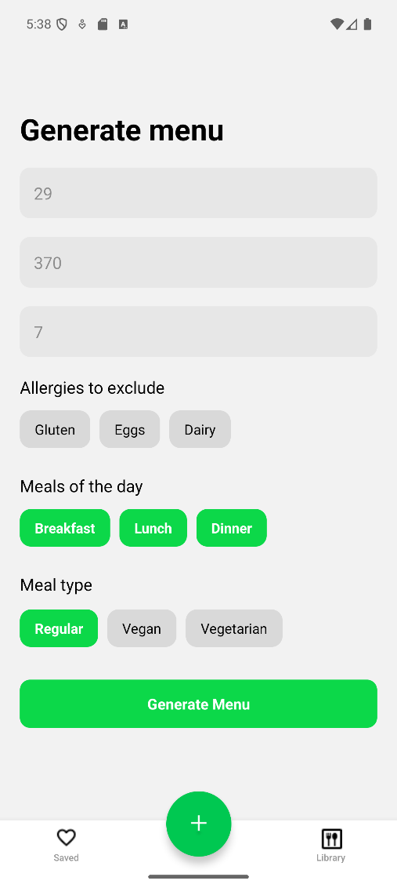
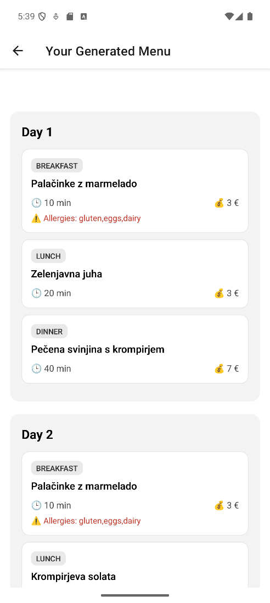
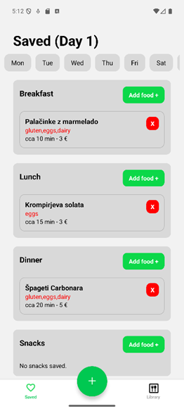
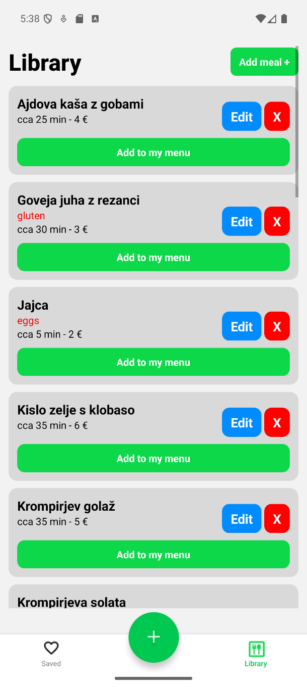

# KupKo (mobile app)

KupKo je mobilna aplikacija za **ustvarjanje večdnevnih jedilnikov** glede na:
- **proračun**,
- **maks. čas priprave**,
- **prehranski tip** (npr. regular/vegan/vegetarian),
- **alergene za izključitev**,
- in **izbrane obroke dneva** (breakfast/lunch/dinner/snacks).

Aplikacija generira jedilnik prek zunanjega API-ja, nato pa omogoča **shranjevanje, urejanje** (dodajanje/brisanje obrokov) ter upravljanje **lokalne knjižnice obrokov**.
Za bolj podrobno dokumentacijo si lahko ogledate [kupko_funk_spec.pdf](kupko_funk_spec.pdf).

## Slike

<p align="center">
  
  
  
  
</p>


## Avtorja
- Rok Rihar
- Blaž Turk

> Backend (API) je Python Flask aplikacija, ki je v ločenem GitHub repozitoriju.

---

## Demo / API

Ključni endpoint za generiranje:
- `GET /random_menu` z query parametri, npr. `n`, `time_of_day`, `allergies`, `max_price`, `meal_type`, `time`

---

## Funkcionalnosti (na kratko)
- **Generate menu**: vnos parametrov in klic API-ja za generiranje jedilnika
- **Results**: prikaz rezultatov ter shranjevanje v lokalno shrambo
- **Saved**: pregled shranjenega menija po dnevih + urejanje (brisanje/dodajanje)
- **Library**: lokalna knjižnica obrokov (CRUD) + dodajanje obroka v meni

---

## Tehnologije
- **React Native** + **Expo**
- **Expo Router** (file-based routing)
- **AsyncStorage** za lokalno shranjevanje (meniji + knjižnica obrokov)

---

## Zagon projekta (lokalno)

### 1) Namesti odvisnosti
```bash
npm install
npx expo start
